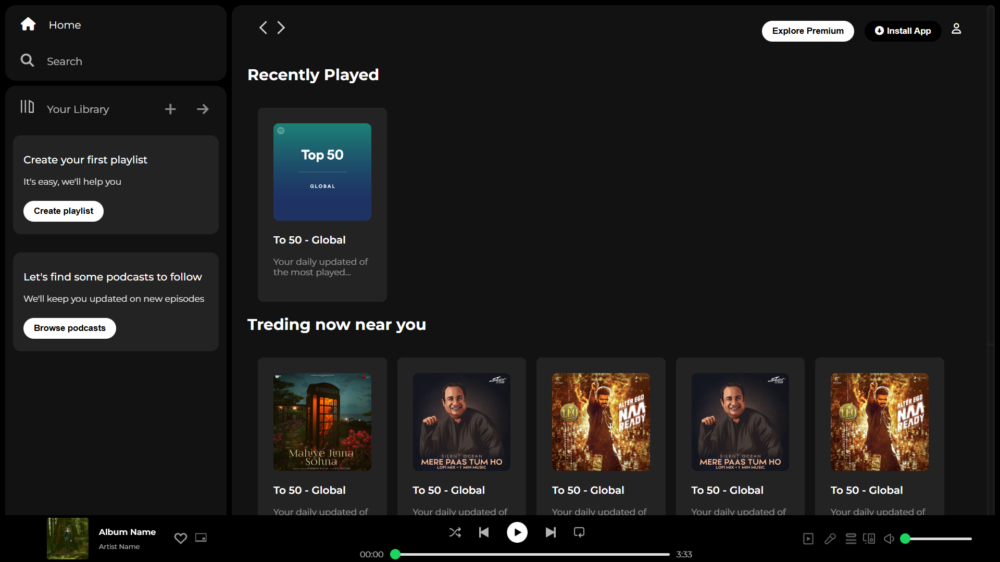

# 🎵 Spotify Clone

Welcome to the **Spotify Clone** project! This project is a static web page built using **HTML** and **CSS** to replicate the look and feel of the Spotify web player. The current version focuses solely on the design and styling aspects, with functionality to be added in future updates.

## 📋 Table of Contents
- [Introduction](#introduction)
- [Features](#features)
- [Screenshots](#screenshots)
- [Technologies Used](#technologies-used)
- [Installation](#installation)
- [Usage](#usage)
- [Future Plans](#future-plans)
- [Contributing](#contributing)
- [License](#license)
- [Contact](#contact)

## 📖 Introduction
This project is a clone of the Spotify web player, created to practice and showcase skills in **HTML** and **CSS**. It includes a responsive design and various static elements to mimic the real Spotify experience.

## ✨ Features
- Responsive design for both desktop and mobile.
- Sleek and modern UI inspired by Spotify.
- Static web page without JavaScript interactions (functionality will be added later).

## 📸 Screenshots



## 🛠 Technologies Used
- **HTML**
- **CSS**
- **Font Awesome** for icons.

## 🚀 Installation
1. Clone the repository:
    ```bash
    git clone https://github.com/yourusername/spotify-clone.git
    ```
2. Navigate to the project directory:
    ```bash
    cd spotify-clone
    ```
3. Open `index.html` in your browser to view the project.

## 💻 Usage
Simply open the `index.html` file in your preferred web browser to explore the Spotify clone.

## 🔮 Future Plans
- Add JavaScript functionality for interactive features like music playback, playlist management, and search.
- Integrate APIs for dynamic content.
- Enhance the design with animations and transitions.

## 🤝 Contributing
Contributions are welcome! Please fork the repository and create a pull request with your changes.

## 📜 License
This project is licensed under the MIT License.

## 📞 Contact
Feel free to reach out to me on [LinkedIn](https://www.linkedin.com/in/alokkumaryadav2410) or check out my other projects on [GitHub](https://github.com/AlokKumarYadav2410).

---

🚀 Excited to share this project and continue improving it with new features in the future!


